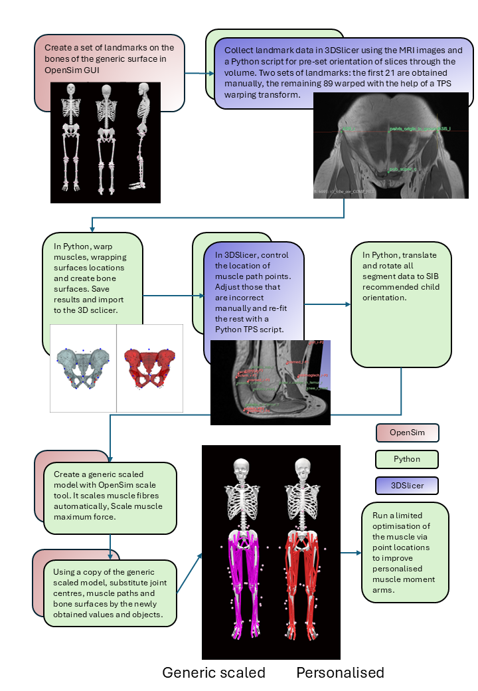

# Personalizing an OpenSim Model with TPS and 3DSlicer

**Files in this repository create a pipeline for personalisation of an OpenSim model.**

To get full information please refer to the publication.

The folder 'worked_example' contains an individual with full set of results. The folder 'example' contains everything to repeat 'worked_example'.

To be able to use this pipeline, you need 
<ul style="float:left;">
<li> a static trial with reflective markers fitted on the sin of the participant </li>
<li> an MRI of the participant</li> 
<li> to have developed a set of bone markers on the surface of the bones of your chosen OpenSim model. These should as many as needed to describe the geometry of each bone plus the centre of its rotation. </li>
</ul>

We provide an example with a set of markers developed for **Rajagopal et al. (2016)** model, where we personalize pelvis, femora, patellae and tibiae segments.

   

1. Preliminary: 
(a) Ensure that the static trial has been extracted from the C3D file (follow the notebook **"model_update/1_extract_static_c3D.ipynb"**)
(b) Create a template with all landmarks in the ground frame. To do so, use the notebook **"mri/results/create_template.ipynb"**. This step is needed to be done only once provided that the template folder is copied to/used for all individuals.

2. Follow instructions in the notebook **"mri/results/orientation_with_tps.ipynb"**. To use it with 3DSlicer, you need to have installed 3DSlicer with JupyterKernel extension. The present code was created in 3DSlicer 5.6.2. Once the kernel is installed, you should be able to choose it as the environment to run the notebook (we use VS Code as an IDE. VS Code is able to detect 3DSlicer Jupyter kernel installation after it has been closed and opened again). The kernel, once loaded, will aitomatically open a managed 3DSlicer window. Please note, that you can only close this window if you close the managing notebook.

3. Once all bone landmarks were collected for the individual, use the notebook **"model_update/2.0_use_mri_data.ipynb"** to create bone surfaces, mucle points and wrapping surfaces locations for the individual.

4. On completing (3) you need to check and correct muscle locations. To do so, use **"mri/control/control.ipynb"** notebook. Once open, the notebook needs to work with the 3DSlicer kernel. The kernel will aitomatically open a managed 3DSlicer window, where you load all bones and transform htem with the help of LinearTRansform.h5. Follow the instructions in the file.

5. On completing control.ipynb, you should proceed with **"model_update/2.1_after_controlling_mri_data.ipynb"**.

6. File **"model_update/3.1_scale_generic_model.ipynb"** scales the generic Rajagopal 2016 template to fit individuals static trial. Please note, this file includes an option to adjust muscle fibre scale using Modenese et al. (2016) pipeline. Please uncomment it if you want to run it.
7. File **"model_update/4_update_generic_model_with_mri_data.ipynb"** takes the generic scaled model with joint centers as markers from the step 3.1 and updates muscle paths, joint locations in parent, locations of wrapping surfaces, skin markers and radii of some of the wrapping surfaces. There is also an option to scale muscle fibres using Modenese et al, (2016) script, which us currently commented out. After each update the model is saved with a different name so one can compare results if needed. Please note that one needs to output an .xml file with skin markers after the first update (*'tps_transformed.osim'*): follow instructions in the notebook.
8. File **model_update/5_optimize_muscles.ipynb** helps to analyse muscle moment arms of the personalised model. The first part plots muscle moment arms. The second part optimizes a list of muscles that you think need to be more like moment arms in the generic scaled model. Please note that the optimisation script may fail to locate a better solution. 